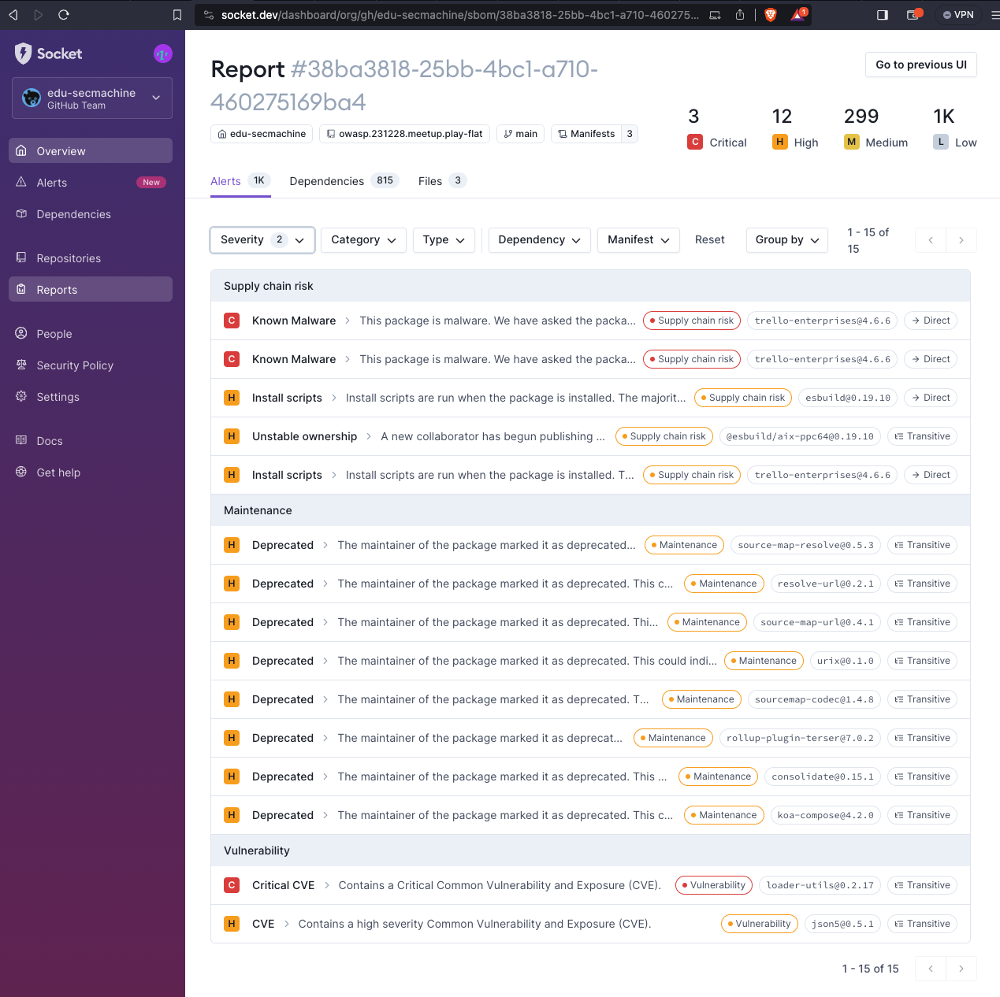
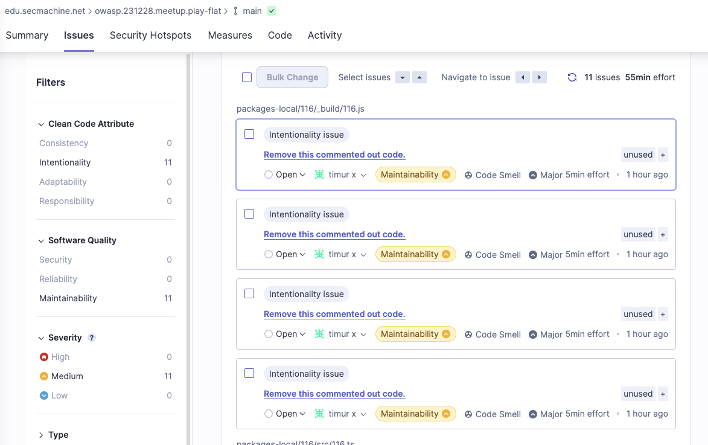

# 231228.meetup.play-flat

## Warning! 
This material deliberately contains (broken) malicious code and will pull (a) vulnerable dep(s) -- since it was used for demo purposes at a supply chain security related presentation.
See show notes:  
https://www.notion.so/owasphu/OWASP-HU-231228-Rogue-deps-4789fbd40e4a4f21be8afa6ca9aada15  

_Do not run this code!!_ 🪆 

### Rogue like parts
* 116 in local packages contains code resembling  
  https://github.com/dominictarr/event-stream/issues/116
* Imported 'trello-enterprises@4.6.6'  
  https://socket.dev/npm/package/trello-enterprises/files/4.6.6/a.js

## Outputs
Date: 23DEC28

### Socket.dev 
(free plan)

### Sonarcloud
(not configured, free plan)

